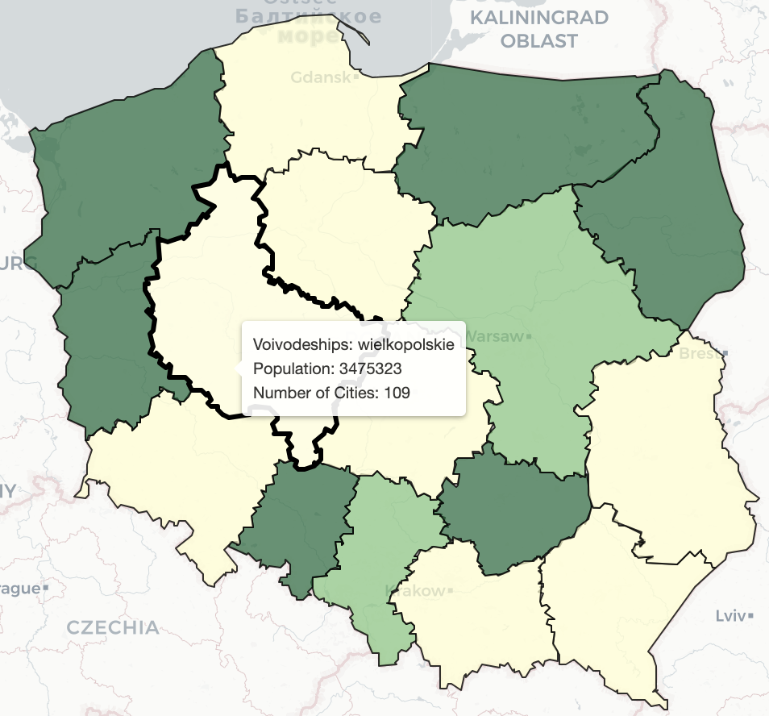
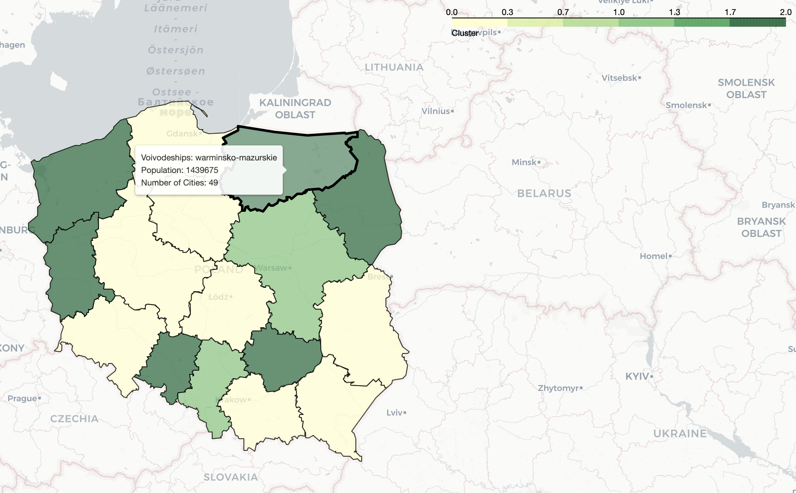

# Clustering and Mapping Voivodeships in Poland
### Objective:
The objective of this project is to analyze and visualize the demographic data of voivodeships in Poland.
The main tasks include clustering the voivodeships based on population and creating a choropleth map
to represent the clusters geographically.
Steps Taken:
### 1. Data Loading:
Loaded demographic data for voivodeships, including population and the number of cities, into a pandas
DataFrame.
Also loaded GeoJSON data containing geographical information for voivodeships in Poland.
### 2. K-Means Clustering:
Applied K-Means clustering on the population data of voivodeships to categorize them into clusters.
Chose the number of clusters (k=3)
### 3. Folium Choropleth Map:
   - Created a base Folium map centered on Poland.
   - Added a choropleth layer to visualize the clustered voivodeships based on population.
   - Utilized the GeoJSON data and DataFrame to integrate geographical and demographic
   information.
   - Highlighted individual voivodeships with transparent boundaries and a tooltip displaying key
   information.
   - Saved the interactive choropleth map as an HTML file
   Script:
   load_data(): Loads voivodeship demographic data into a DataFrame.
   load_geojson(): Retrieves GeoJSON data containing geographical information for voivodeships.
   apply_kmeans_clustering(): Applies K-Means clustering to voivodeships based on population.
   create_choropleth_map(): Creates a Folium choropleth map with clustered voivodeships.

*Screenshot 1.*

*Screenshot 2.*

